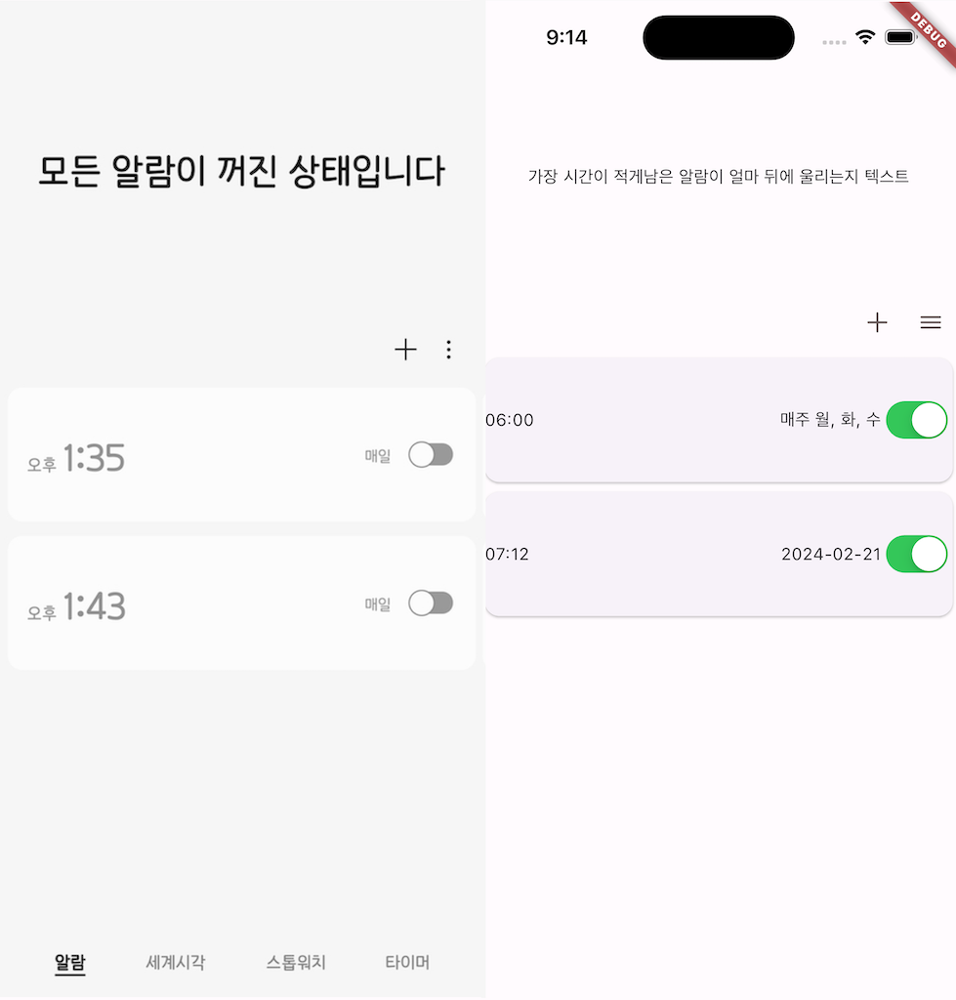
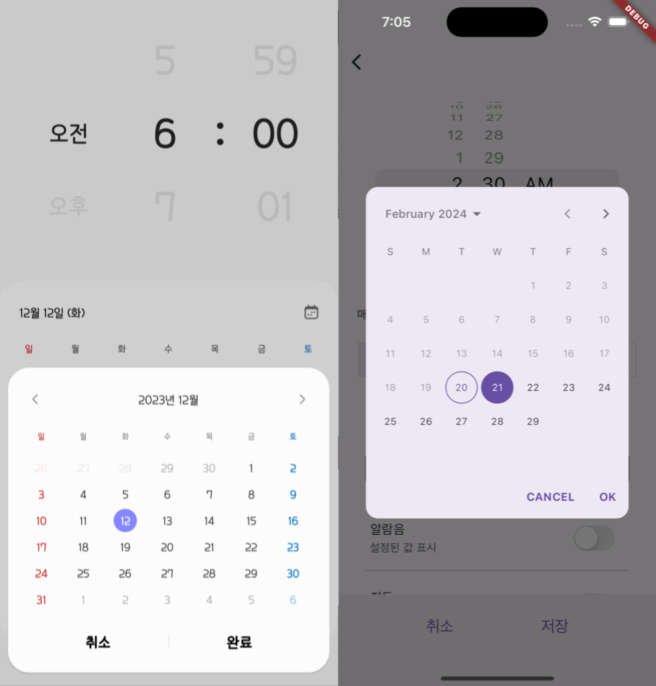
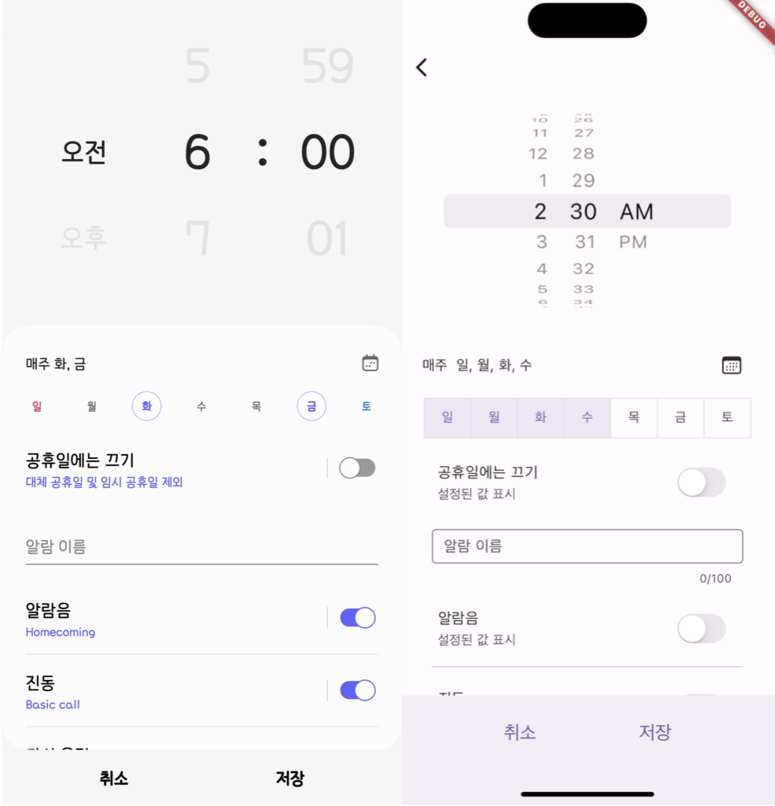
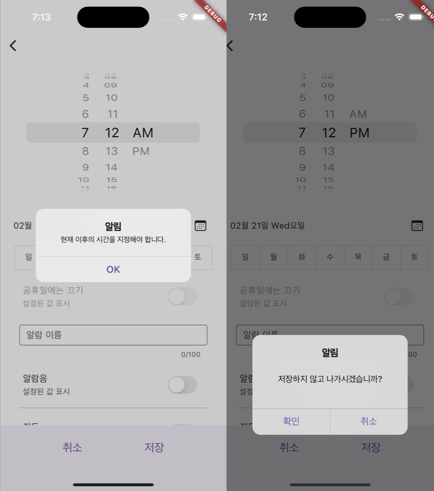
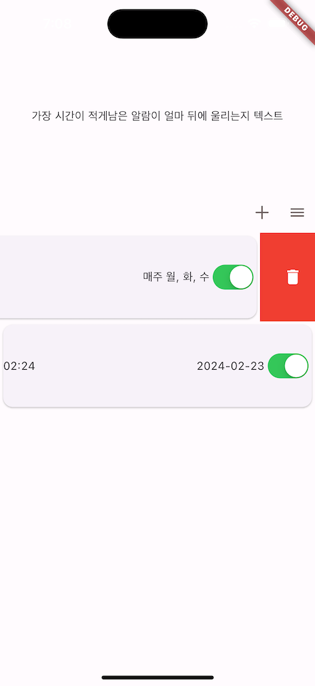
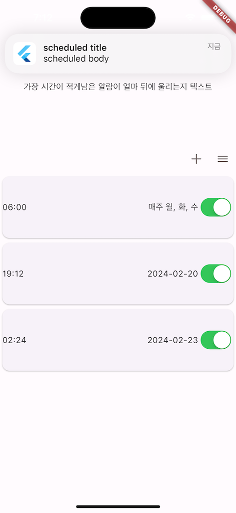

# myalarm
    갤럭시에서 제공하는 알람 앱 플러터로 따라 만들어 보기

## 구현된 부분(좌:갤럭시, 우:플러터)
1. 기본적인 UI 구성
    
2. 알람 추가(날짜 선택 calendar_date_picker2, 요일 선택)
    
    
3. dialog(저장하지 않고 나갈때, 현재 이전의 시간을 선택했을 때)
    
4. 저장된 알람 수정  
5. 밀어서 알람 삭제
    
6. 알람 시간에 알림(notification)
    
   
## 알람 관리
1. 알람 목록 관리 : sqflite
2. 알림 관리 : flutter_local_notifications

## 미구현 및 한계 
1. 알림음, 반복, 진동 설정
   - 알림음 접근, 알람, 소리 설정같이 권한에 관련된 부분은 네이티브 개발 필요
  
2. 알람 화면 한계
   - 원하는 만큼의 기능을 지원하는 패키지가 없었고 직접 개발을 위해서는 마찬가지로 네이티브 개발 필요
   